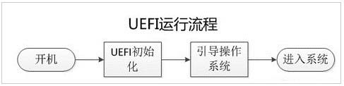

###开学重装系统：

**`2017.2.15`**

[TOC]

又是一个开学的好日子啊，重装系统的工作差不多耗了我三天的时间，不过好在现在一切都步上了正轨，工作可以如期地往下进行了。

-------------------------
#### 1. 装双系统(UEFI)启动方式
* UEFI:统一的可扩展固件接口,详细描述类型接口的标准.用于操作系统从预启动的操作环境,加载到另一种操作环境.

	##### UEFI 和 BIOS 比较:
	1. 安全性强
		有专用的独立分区来引导系统,保护系统的启动
        
        
	2. 启动配置更灵活
		EFI启动和GRUB启动类似，在启动的时候可以调用EFIShell，在此可以加载指定硬件驱动，选择启动文件。比如默认启动失败，在EFIShell加载U盘上的启动文件继续启动系统。
        
    3. 支持容量更大
    	传统的BIOS启动由于MBR的限制，默认是无法引导超过2.1TB以上的硬盘的。随着硬盘价格的不断走低，2.1TB以上的硬盘会逐渐普及，因此UEFI启动也是今后主流的启动方式。

> **注意:**
> 1. 如果需要安装双系统,那么我们的系统应该统一采用 UEFI 的启动方式,并且在 BIOS 中选择引导方式为 UEFI
> 2. 在更新完毕 windows 系统时,重新开机进入的引导项可能没有 ubuntu 的选项 这时只需用软件 easyUEFI 将 ubuntu 启动项的优先位置上调即可

-----------------
#### 2. 安装 ubuntu 的中文输入法问题
1. 在 system setting 中先将 language support -> Keyboard input method system -> fcixt(更新为)
2. 安装 sougou 软件/打开 fcixt 添加 pinyin

---------------------------
#### 3. 安装 Haroopad
参考:
[install haroopad on linux by tar.gz](http://www.jianshu.com/p/dba9acabf0a7)

--------------------------
**THE END**