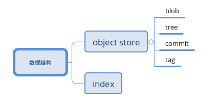

git 版本控制管理
===============================
`2017.3.3---天气：晴`

[TOC]

#### git 的基本概念

**配置文件**

| filename | explain | config |
|:-----:|:---:|:---:|
| .git/config | git的配置设置,为默认选项,具有最高优先级|--file选项修改|
|~/.gitconfig | 用户特定配置,全局变量 | --global选项修改 |
| /etc/gitconfig | 系统范围配置设置	| --system选项修改 优先级最低 |

**git 版本库**
一个简单的数据库,用于维护和管理项目的修订版本和历史信息

主要的两个数据结构 : object store & index

> **SHA**: SHA 散列 ID 是有效的全局唯一标识符.在不同目录甚至是机器中,相同文件内容产生的 SHA1 哈希 ID 是唯一的.
> 在互联网中任意的文件都可以通过比较他们的 SHA1 标识符来判断是否相同

**git 内容追踪**
由散列值的概念:
1. git 追踪的是内容而不是文件名,路径等(当文件内容相同时,在 git 中只保存一个副本)
2. git 保存的是每个文件的版本,而不是版本间的差异(保存着修订版本和版本间的步进)

**打包文件**
git 会将相似的一系列文件打包,之后通过文件之间的差异还原文件.这个相似并不只限制于同一个文件的不同版本.

> 这也解释了上面存储文件的每个版本并不是真的存储它们的全部内容.

