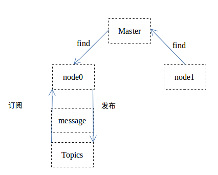
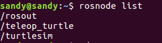
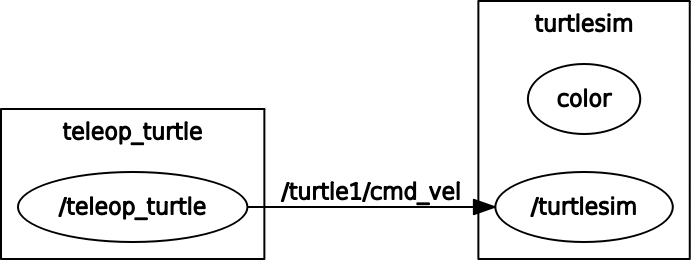

### ROS 的使用

[TOC]

#### ROS 工作环境
创建工作目录
```
mkdir -p catkin_ws/src
cd catkin_ws/src
catkin_init_workspace

cd ..
catkin_make
```

#### ROS 文件系统一览

```
//sudo apt-get install ros-<distro>-ros-tutorials

```

**package:**
packages 是 ROS 代码的软件组织单位.可包括库文件,可执行文件,脚本和其他工件

------------

**package.xml:**
是对包的描述.包括包之间的依赖关系,并且维护包的元信息,版本,维护者,许可证等.

#### 文件工具
rospack:获取包的信息  `rospack help` 得到使用方法

---------
roscd:将`ROS`工作目录直接跳转到目录下(中间可能间隔好几个目录)
roscd 只寻找在你的 ROS_PACKAGE_PATH 中存在的路径目录
`echo $ROS_PACKAGE_PATH` 可以添加路径,中间用 `:` 隔开


rosls: 列出文件夹的内容,和 roscd 相像

#### 创建 ROS package
catkin 包组成
1. package.xml
2. CMakelists.txt 文件
3. 一个目录中只能包含一个 package

-------------
工作空间结构:

		workspace_folder/        -- WORKSPACE
  		src/                   -- SOURCE SPACE
    	CMakeLists.txt       -- 'Toplevel' CMake file, provided by catkin
   		package_1/
      	CMakeLists.txt     -- CMakeLists.txt file for package_1
      	package.xml        -- Package manifest for package_1
    	...
    	package_n/
      	CMakeLists.txt     -- CMakeLists.txt file for package_n
      	package.xml        -- Package manifest for package_n

-----------------
创建一个 catkin 程序包
```
cd ~/catkin_ws/src
catkin_create_pkg beginner_tutorials std_msgs rospy roscpp
//catkin_create_pkg <package_name> [depend1] [depend2] [depend3]
```

-----------
自定义 package.xml

描述标签: `<description>......</description>`
维护者标签:`<maintainer email="you@yourdomain.tld">Your Name</maintainer>`
许可标签:`<license>BSD</license>
`
依赖项标签:build_depend、buildtool_depend、run_depend、test_depend

#### 编译 ROS 程序包
source 环境配置文件
```
source /opt/ros/<version>/setup.bash

# 在catkin工作空间下
catkin_make [make_targets] [-DCMAKE_VARIABLES=...]
```

创建一个 package ,再运行 catkin_make

#### 理解 ROS 节点
**概念**
> 
Nodes:节点,一个节点即为一个可执行文件，它可以通过ROS与其它节点进行通信。
Messages:消息，消息是一种ROS数据类型，用于订阅或发布到一个话题。
Topics:话题,节点可以发布消息到话题，也可以订阅话题以接收消息。
Master:节点管理器，ROS名称服务 (比如帮助节点找到彼此)。
rosout: ROS中相当于stdout/stderr。
roscore: 主机+ rosout + 参数服务器 (参数服务器会在后面介绍)。



---------------
**运行测试:**
`roscore` 开启服务器
显示当前运行的 ROS 节点:`rosnode list`

运行一个包内的节点
`rosrun [package_name] [node_name]`
eg : `rosrun turtlesim turtlesim_node`

`rosnode ping [node_name]`

#### 理解 ROS 话题
1. 开启 `roscore`
2. 打开一个 turtlesim 节点并且打开键盘控制 `rosrun turtlesim turtlesim_node` & `rosrun turtlesim turtle_teleop_key` 之后就可以用键盘控制 turtle 的运行

--------------
**turtle 背后发生的故事**


当运行上述命令之后,可以看到除了 rosout 节点,还有两个节点,那么这两个节点是怎么通信的呢

teleop_turtle 在一个话题上发布按键输入消息，而 turtlesim 则订阅该话题以接收该消息。下面让我们使用rqt_graph来显示当前运行的节点和话题.

运行 `rosrun rqt_graph rqt_graph`,结果显示:

/turtle1/cmd_vel 是话题

**rostopic**
命令解释可以使用`help`选项去了解

rostopic pub:
将数据发布到某个正在广播的话题中
`rostopic pub [topic] [msg_type] [args]`

rqt_plot命令可以实时显示一个发布到某个话题上的数据变化图形

#### 理解 ROS 服务和参数
服务（services）是节点之间通讯的另一种方式。服务允许节点发送请求（request） 并获得一个响应（response）

---------
**rosservice**
有9个服务
rosservice call [service] [args]
rosservice type spawn| rossrv show

-------------
**rosparam**
rosparam list

rosparam set [param_name]
rosparam get [param_name]

使用rosparam get /来显示参数服务器上的所有内容

rosparam dump [file_name]
rosparam load [file_name] [namespace]

#### 使用 rqt_console 和 roslaunch
`rosrun rqt_console rqt_console`:显示节点的输出信息
`rqt_logger_level` 允许我们修改节点运行时输出信息的日志等级（logger levels）

日志等级:
`Fatal Error Warn Info Debug`

roslaunch [package] [filename.launch]

#### 使用 rosed 编辑 ROS 中的文件
rosed [package_name] [filename]

#### 创建 ROS 消息和 ROS 服务
* 消息(msg): msg文件就是一个描述ROS中所使用消息类型的简单文本。它们会被用来生成不同语言的源代码。
* 服务(srv): 一个srv文件描述一项服务。它包含两个部分：请求和响应。

**创建一个可执行的 msg**
1. 定义 .msg 文件
2. 确认在 package.xml 文件中存在相应的依赖
`<build_depend>message_generation</build_depend>
 <run_depend>message_runtime</run_depend>`

3. 在 CMakeLists.txt 文件中
	* 利用 find_packag 函数增加 `message_generation` 依赖
	* catkin_package 函数中设置运行依赖 `CATKIN_DEPENDS message_runtime`
	* 增加消息文件到喜那个相应的代码中
        ```
        add_message_files(
          FILES
          Num.msg
        )
        ```
	* 重新配置 project ,增加代码:`generate_messages()`

rosmsg show [message type]

**创建 srv 服务**
1. 在包中创建 srv 文件夹
2. 文件家中包含一个 .srv 文件
3. 在 CMakeLists.txt 的 find_package 中加入依赖项 file 中加入文件的名字

------------------
> 未成功显示消息,官方文档肯定哪里出现了错误!