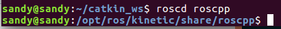

### ROS 的使用

[TOC]

#### ROS 工作环境
创建工作目录
```
mkdir -p catkin_ws/src
cd catkin_ws/src
catkin_init_workspace

cd ..
catkin_make
```

#### ROS 文件系统一览

```
//sudo apt-get install ros-<distro>-ros-tutorials

```

**package:**
packages 是 ROS 代码的软件组织单位.可包括库文件,可执行文件,脚本和其他工件

------------

**package.xml:**
是对包的描述.包括包之间的依赖关系,并且维护包的元信息,版本,维护者,许可证等.

#### 文件工具
rospack:获取包的信息  `rospack help` 得到使用方法

---------
roscd:将`ROS`工作目录直接跳转到目录下(中间可能间隔好几个目录)
roscd 只寻找在你的 ROS_PACKAGE_PATH 中存在的路径目录
`echo $ROS_PACKAGE_PATH` 可以添加路径,中间用 `:` 隔开


rosls: 列出文件夹的内容,和 roscd 相像

#### 创建 ROS package
catkin 包组成
1. package.xml
2. CMakelists.txt 文件
3. 一个目录中只能包含一个 package

-------------
工作空间结构:

		workspace_folder/        -- WORKSPACE
  		src/                   -- SOURCE SPACE
    	CMakeLists.txt       -- 'Toplevel' CMake file, provided by catkin
   		package_1/
      	CMakeLists.txt     -- CMakeLists.txt file for package_1
      	package.xml        -- Package manifest for package_1
    	...
    	package_n/
      	CMakeLists.txt     -- CMakeLists.txt file for package_n
      	package.xml        -- Package manifest for package_n

-----------------
创建一个 catkin 程序包
```
cd ~/catkin_ws/src
catkin_create_pkg beginner_tutorials std_msgs rospy roscpp
//catkin_create_pkg <package_name> [depend1] [depend2] [depend3]
```

-----------
自定义 package.xml

描述标签: `<description>......</description>`
维护者标签:`<maintainer email="you@yourdomain.tld">Your Name</maintainer>`
许可标签:`<license>BSD</license>
`
依赖项标签:build_depend、buildtool_depend、run_depend、test_depend

#### 编译 ROS 程序包
source 环境配置文件
```
source /opt/ros/<version>/setup.bash

# 在catkin工作空间下
catkin_make [make_targets] [-DCMAKE_VARIABLES=...]
```

创建一个 package ,再运行 catkin_make

#### 理解 ROS 节点
**概念**
> 
Nodes:节点,一个节点即为一个可执行文件，它可以通过ROS与其它节点进行通信。
Messages:消息，消息是一种ROS数据类型，用于订阅或发布到一个话题。
Topics:话题,节点可以发布消息到话题，也可以订阅话题以接收消息。
Master:节点管理器，ROS名称服务 (比如帮助节点找到彼此)。
rosout: ROS中相当于stdout/stderr。
roscore: 主机+ rosout + 参数服务器 (参数服务器会在后面介绍)。


---------------
**运行测试:**
`roscore` 开启服务器
显示当前运行的 ROS 节点:`rosnode list`

运行一个包内的节点
`rosrun [package_name] [node_name]`
eg : `rosrun turtlesim turtlesim_node`

`rosnode ping [node_name]`
